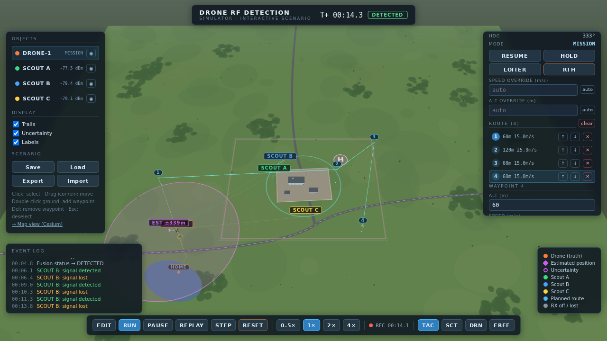

# gaema-rfuav-synth

GAEMA-1 드론 RF 탐지 프로젝트의 **RFUAV-like synthetic IQ/STFT 데이터 생성 하네스** (V0).

[RFUAV 논문](https://arxiv.org/abs/2503.09033)([공식 repo](https://github.com/kitoweeknd/RFUAV), [HF 데이터셋](https://huggingface.co/datasets/kitofrank/RFUAV))의 실측 드론 RF spectrogram morphology를 분석하고, 그 파라미터(FHSBW/FHSDT/FHSDC/FHSPP/VTSBW)를 반영한 **complex IQ 신호를 먼저 생성한 뒤 RFUAV와 동일 계열의 STFT 파이프라인으로 변환**해, 향후 YOLO detection / ResNet·ViT classification 학습에 쓸 수 있는 보강 데이터셋을 만든다.

## Interactive 3D simulator

`apps/drone-rf-sim`에는 같은 탐지 개념을 조작 가능한 시나리오로 확인하는 웹 시뮬레이터가 포함되어 있다. PlayCanvas 3D 현장뷰와 Cesium 지도뷰가 하나의 시뮬레이션 엔진을 공유하며, 실행 중 Waypoint 편집, Scout 배치, Mock RF 다변측량, 카메라 전환, 저장/로드 및 리플레이를 지원한다.



- [78초 시뮬레이션 데모 MP4](apps/drone-rf-sim/media/simulation-demo.mp4)
- [상세 실행 및 조작 방법](apps/drone-rf-sim/README.md)

```bash
cd apps/drone-rf-sim
npm ci
npx playwright install chromium
npm run dev
npm run verify  # 현재 소스 빌드 + Playwright 상호작용 검증
```

## 원칙

- Spectrogram 이미지를 직접 그리지 않는다 — 항상 IQ → STFT 경로만 사용.
- Synthetic은 RFUAV 실측의 **대체가 아니라 보강**이다 (sim-to-real gap 유의).
- 모든 샘플은 `(label, drone, snr_db, random_seed)` + configs로 재현 가능.
- 프로토콜 디코딩(OcuSync/DroneID/ELRS 등)·조종자 위치 추정·확정 판정 라벨은 다루지 않는다. 모든 클래스는 `*_like` morphology 클래스다.

## 설치 및 실행

```bash
python3 -m venv .venv && .venv/bin/pip install -r requirements.txt
.venv/bin/python -m pytest tests/ -q                      # 테스트
.venv/bin/python scripts/download_rfuav_sample.py         # 실측 subset (~50MB)
.venv/bin/python scripts/extract_real_features.py         # 실측 morphology 추정
.venv/bin/python scripts/generate_synthetic_iq.py         # synthetic 데이터셋 생성
.venv/bin/python scripts/compare_real_synthetic.py        # real vs synthetic preview + 수치 비교
.venv/bin/python scripts/preview_synthetic_dataset.py     # grid + bbox overlay preview
# 임의 IQ 파일(RFUAV raw 포함) → spectrogram:
.venv/bin/python scripts/make_spectrogram.py path/to/file.iq --fs 100e6
# Fig.8-style STFT sensitivity (real raw IQ / synthetic IQ):
.venv/bin/python scripts/stft_sensitivity.py --iq outputs/raw/xxx.dat --out outputs/stft_sensitivity_real.png
.venv/bin/python scripts/stft_sensitivity.py --synthetic-drone DJI_MINI3 --out outputs/stft_sensitivity_synthetic.png
# specs.json에서 IQ 재생성 (IQ 저장은 기본 off — seed+config로 byte-identical 복원):
.venv/bin/python scripts/regenerate_iq.py <sample_id>
```

개발용 경량 프레임: `--frame-preset dev_light` (25 MS/s, 0.05 s — 기본 `rfuav_full`=100 MS/s, 0.1 s 대비 16배 가벼움).

## 구조

```
configs/               # stft(프리셋 3종)·synthetic(생성 계획)·rfuav(실측 접근)·dataset
gaema_rfuav_synth/
  rfuav/               # 논문 Table 4 파라미터, HF 샘플 로더, 이미지 기반 feature 추정
  signal/              # FHSS/video/interference 생성기, noise, SNR, channel, impairments
  transform/           # RFUAV 재현 STFT, spectrogram 내보내기(PNG/NPY), colormap
  labeling/            # SignalEvent → YOLO bbox(wrap-around 분할), 클래스 taxonomy
  dataset/             # metadata/feature_params 스키마, exporter, ImageFolder splitter
  viz/                 # real-vs-synth 비교, grid preview, bbox overlay
scripts/               # 위 실행 스크립트
tests/                 # pytest
docs/rfuav_repo_analysis.md   # RFUAV repo/논문/데이터 분석 보고서
outputs/               # (gitignore) real_samples/, synthetic_samples/, preview PNG
external/RFUAV         # (gitignore) 참고용 shallow clone
```

## Synthetic 클래스 (7종)

`noise_only(0)`, `rfuav_fhss_like(1)`, `rfuav_video_like(2)`, `rfuav_fhss_video_like(3)`, `wifi_like(4)`, `lora_iot_like(5)`, `mixed_interference(6)`

검출 박스 클래스: `fhss_burst(0)`, `video_signal(1)`, `wifi_burst(2)`, `lora_chirp(3)` — 생성 파라미터에서 버스트별 정밀 time-freq bbox를 계산해 YOLO 포맷으로 저장 (RFUAV 원본의 고정 bbox 방식보다 정밀).

## STFT 프리셋 (configs/stft_config.yaml)

| 프리셋 | 근거 | 설정 |
|---|---|---|
| `rfuav_repo` | 공식 repo `RawDataProcessor.py` 기본 | 1024pt, Hamming, 50% overlap, jet, autoscale |
| `rfuav_paper_best` | 논문 ablation 최적 (기본값) | 256pt, Hamming, 50%, hot, fixed 70dB range |
| `rfuav_matlab_like` | 공개 ImageSet 생성 경로 (비교용) | 1024pt, Hann, 75%, parula-like |

공통: two-sided + fftshift, `10*log10(|Zxx|)`, fs=100 MS/s, 프레임 0.1 s.

## Augmentation

AWGN SNR 제어(-20…+20 dB, 2 dB step), frequency shift(bbox wrap-around 재계산 포함), amplitude fading, burst timing jitter, burst dropout, interference injection(wifi/lora/mixed) + 수신기 임페어먼트(DC spike, IQ imbalance, CFO, phase noise, band-edge roll-off).

## FHSBW 해석 (중요)

논문 Table 4의 FHSBW는 **호핑 전체 span**으로 해석한다. 근거: FUTABA T14SG 실측 이미지의 개별 버스트 폭은 3–4 MHz인데 FHSBW는 32 MHz이고, DJI MINI3의 버스트들은 3.5 MHz(=FHSBW) 안에 머문다. 개별 버스트 폭은 `max(FHSBW/burst_bw_divisor, min(FHSBW, burst_bw_floor_mhz))`로 근사하며 (configs/synthetic_config.yaml), V1에서 실측 feature 추정으로 보정 예정.

## V1: real-like 보정 워크플로

기종별로 아래 루프를 돌려 정량 게이트를 통과시킨다:

```bash
# 1) raw IQ에서 feature 추정 (2D 평활 + per-frequency 노이즈 플로어 + peak 필터)
.venv/bin/python scripts/extract_raw_features.py "outputs/raw/<드론>/pack1_0-1s.iq" --drone <DRONE>
# 2) 실측 배경 pool 추출 (버스트 사이 quiet 구간)
.venv/bin/python scripts/extract_background.py "outputs/raw/<드론>/pack1_0-1s.iq" --drone <DRONE>
# 3) 파라미터 피팅 (bandwidth는 폐루프 보정: 생성→측정→수렴)
.venv/bin/python scripts/fit_drone_params.py --drone <DRONE>   # -> configs/fitted_params.yaml
# 4) 정량 검증 게이트
.venv/bin/python scripts/validate_real_vs_synthetic.py --drone <DRONE> --iq "..."
```

- 파라미터 우선순위: **fitted(raw IQ) > real-informed overrides > 논문 Table 4**
- synthetic 생성 시 `background_path`를 주면 AWGN 대신 **실측 배경 pool**을 mixing (SNR은 배경 파워 기준). 배경에 DC spike/roll-off/주변 간섭이 이미 포함되므로 synthetic 임페어먼트는 생략됨.
- FHSS 버스트는 Gaussian PSD(GFSK형 스커트) + 진폭/길이/주파수/타이밍 jitter.

**통과 기준** (configs/validation_config.yaml): bandwidth 상대오차 ≤20%, burst duration ≤30%, hopping interval ≤30%, energy histogram Wasserstein distance ≤ 실측 프레임간 baseline의 2배. 측정은 real/synthetic 모두 동일한 raw-IQ 추정기로 수행(apples-to-apples). baseline의 실측 프레임은 시간적으로 떨어진 raw 파일 2개(0–1s / 3–10s)에서 취해 실측 자체 변동성을 반영한다.

**V1 게이트 결과 (2026-07-07, outputs/validation_report.csv)** — 두 기종 모두 전체 PASS:

| 기종 | bandwidth | burst duration | hopping interval | video bandwidth | energy hist |
|---|---|---|---|---|---|
| DJI_MINI3 | 0.0% ✓ | 2.8% ✓ | 3.4% ✓ | 4.0% ✓ | 0.80× ✓ |
| FUTABA_T14SG | 0.0% ✓ | 1.8% ✓ | 0.7% ✓ | 1.9% ✓ | 1.09× ✓ |

**단위 규약 주의**: STFT dB는 RFUAV 재현을 위해 `10*log10(|Zxx|)` (magnitude-dB)이며, power-dB의 절반 크기다. feature 추정치의 over-floor/SNR 값도 이 규약을 따르고, 레벨 매칭 스케일 공식은 `10^(t/5)`로 변환한다 (`dataset/exporter.py` 참조).

**MINI3에서 확인된 실측 구조**: DJI video 링크는 연속파가 아니라 **~10 MHz 폭 TDD 슬롯 버스트**다(OcuSync 구조). 추정기는 광대역(≥5 MHz)/협대역 두 모집단을 분리해 video 슬롯(vtsbw/center/slot/duty)과 제어 FHSS를 각각 피팅한다. duty는 병합 영역 때문에 간격 기반 추정이 불안정하므로 **밝은 셀 점유율에서 역산**하고, per-frequency median floor가 신호를 흡수하기 시작하는 0.45를 상한으로 둔다.

## 비교 게이트 (V0)

real-vs-synthetic 비교는 `compare_drones: [DJI_MINI3, FUTABA_T14SG]` 2종으로 먼저 통과시키고, 이후 MINI4 PRO / AVATA2 / MAVIC3 PRO로 확장한다. 산출물: `preview_real_vs_synthetic.png`(육안), `real_vs_synthetic_metrics.csv`(bandwidth/burst duration/hopping interval, paper vs real-est vs synth-est), `real_vs_synthetic_energy_hist.png`(intensity 분포), `stft_sensitivity_{real,synthetic}.png`(Fig.8-style).

## Raw IQ 검증 (완료)

HF의 `FUTABA T14SG.rar`(2.65 GB)를 받아 검증 완료. rar 내부는 1초 단위 `.iq`(800 MB = 100 MS/s × 8 bytes, **interleaved float32**) + `.xml` 사이드카(USRP X310, fs=100 MHz, fc=2.44 GHz, ReferenceSNRLevel 24 dB) — 분석 문서의 포맷 가정과 정확히 일치. `load_raw_iq`/`load_sidecar_xml` → `make_spectrogram.py` → `stft_sensitivity.py`까지 실데이터로 통과. **압축 해제는 `unar` 필요** (`brew install unar`; p7zip은 이 RAR5 방식 미지원).

## Real-informed 파라미터 보정

논문 Table 4 추출값이 실측 morphology와 모순되면 실측이 우선한다 (`rfuav/paper_params.py`의 `REAL_INFORMED_OVERRIDES`). 현재: FUTABA T14SG — 실측은 ~0.3–0.5 ms 버스트가 ~1–2 ms 간격으로 ~80 MHz에 걸쳐 호핑 (추출값 FHSDT 2.3 ms / FHSDC 30.1 ms / FHSBW 32 MHz와 불일치).

## 알려진 V1 한계

- RC 전용 조종기(FUTABA 등)의 raw 캡처에서도 wide(≥5 MHz) 모집단이 검출되어 video 키가 피팅될 수 있다 — 실체는 주변 광대역 간섭 또는 인접 채널 호핑의 병합이다. **캡처 수준 morphology 재현으로는 유효**하지만, RC 전용 기종의 `video_signal` YOLO 박스는 학습 시 간섭으로 취급해야 한다 (V2에서 지속성 기반 모집단 분리 예정).
- fitted 파라미터는 특정 raw pack 1–2개 기준이다. 동일 기종이라도 캡처 세션(모드/거리)에 따라 slot 간격 등이 달라질 수 있다 (공개 ImageSet 프레임과 slot 밀도가 다른 것이 그 예).

## 알려진 V0 한계

- 이미지 기반 feature 추정은 threshold 연결영역 방식이라 저대비 버스트가 조각나 burst duration/bandwidth를 과소추정할 수 있음 (real/synthetic에 동일 적용되므로 상대 비교는 유효).
- 실측 JPEG에서의 SNR 추정치는 intensity-ratio **proxy**임 (colormap+JPEG는 파워 선형이 아님).
- 논문 Table 4 수치는 arXiv HTML 추출본 — 외부 인용 전 원문 대조 필요 (FUTABA 행은 실측과 모순 확인됨).
- synthetic 버스트는 실측 대비 내부 텍스처가 균일하고 배경 잡음 텍스처가 매끈함 — V1에서 실측 배경 mixing으로 개선 예정.
